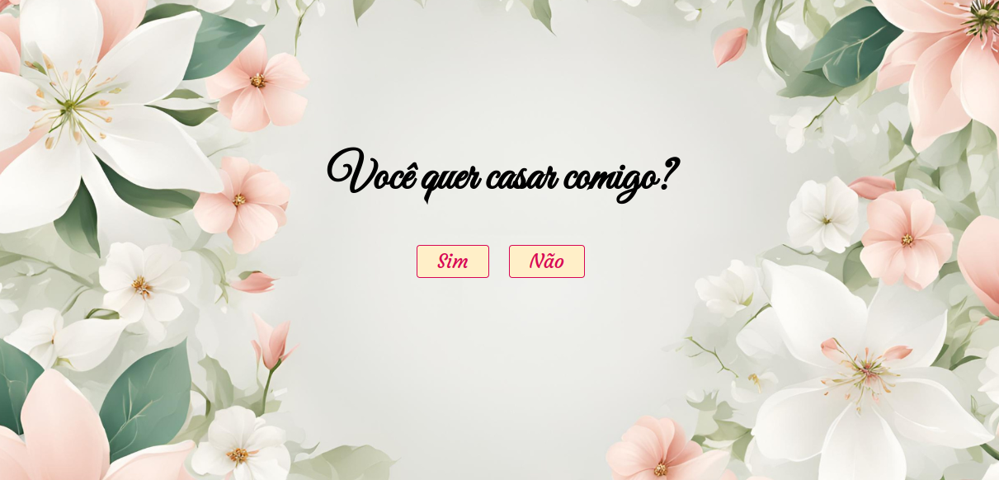
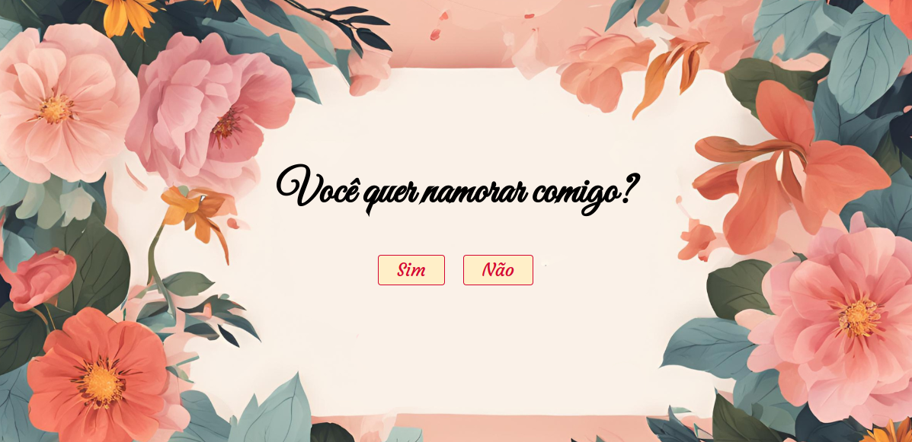
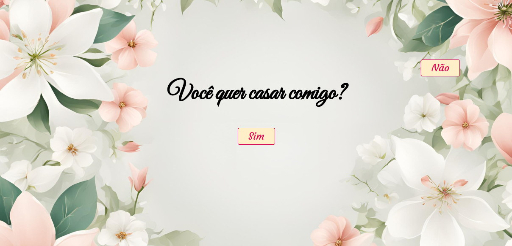
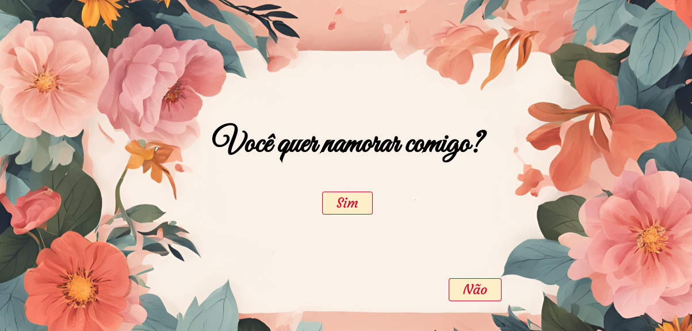
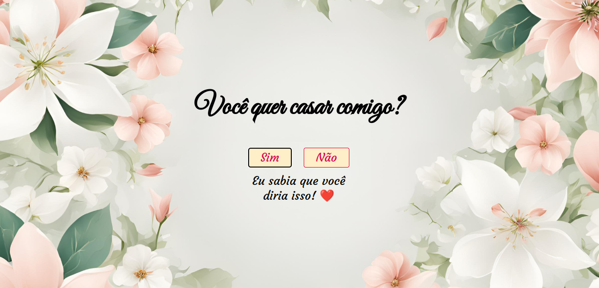
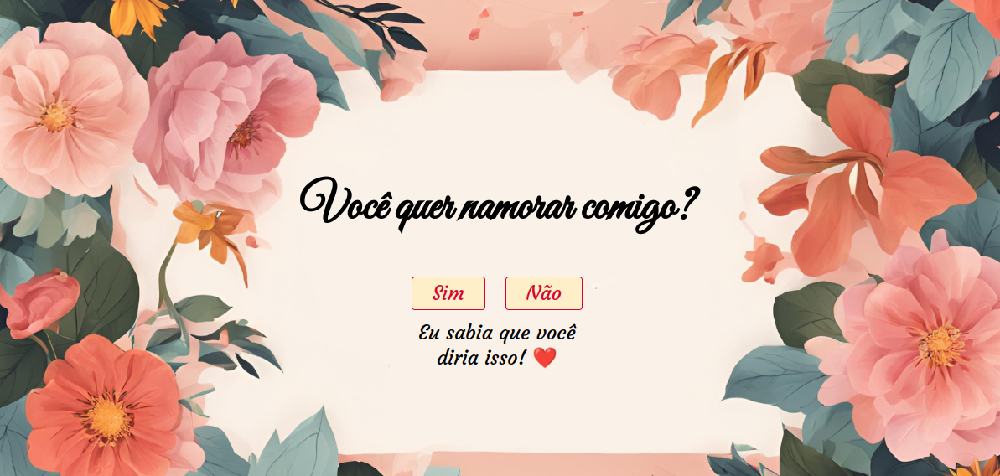

## 💖 Special Day

O **Special Day** é uma aplicação interativa e divertida para fazer um **pedido especial de namoro ou casamento**. São duas versões disponíveis, salvas em **branches separadas**, cada uma com sua identidade visual. A proposta é simples: surpreender alguém especial com um pedido inesquecível!

## 🚀 Sobre o Projeto

Essa aplicação foi desenvolvida **sem base em cursos específicos**. Para criá-la, explorei **tutoriais, fóruns e documentações**, aprendendo conforme a necessidade e testando ideias até chegar ao resultado final.

A aplicação apresenta duas versões:

* 💍 **Pedido de Casamento –** exibe a pergunta: "Você quer casar comigo?"
* 💌 **Pedido de Namoro –** exibe a pergunta: "Você quer namorar comigo?"

Ambas compartilham a mesma estrutura interativa:

* **Botão "Sim":** ao clicar, exibe uma mensagem positiva e romântica;
* **Botão "Não":** ao tentar clicar, ele foge para outra parte da tela, tornando impossível dizer "não"!

## 🌿 Estrutura das Branches

O projeto está dividido em duas branches principais:

* versao-casamento - Versão com fundo e mensagem para pedido de casamento;
* versao-namoro - Versão com fundo e mensagem para pedido de namoro.

Você pode alternar entre as versões diretamente no GitHub ou clonar a branch desejada para personalizar.

## 🛠️ Tecnologias Utilizadas

                                      

## 🖼️ Visualização do Projeto

Uma prévia das principais funcionalidades do **Special Day**:

**🌐 Acesse o Projeto Online**

O projeto está disponível para visualização na **Vercel**. Clique no link abaixo para acessar:

**🏠 Páginas** 

Página inicial do projeto, com fundo, mensagem e botões para resposta.

**💖 Funcionalidade do botão "não"**

Botão não fugindo quando o mouse chega próximo a ele.

**💖 Funcionalidade do botão "sim"**

Resposta do botão sim quando clicado.

